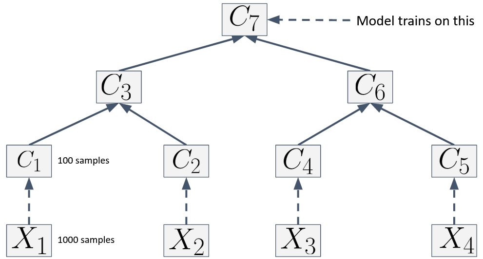
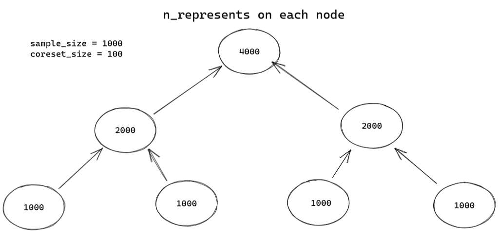

# skcoreset 2

## Installation

For developers install the `[dev]` version. Go to the root folder and run:

```
pip install .
pip install .[dev]
```

or to track local live changes:

```
pip install -e .
pip install -e .[dev]
```

## API

**Modules**:

- `skcoreset.sampling` = Coresets are here
- `skcoreset.sklearn_extra` = Extra implementations of scikit-learn algorithms (such as weighted variants)
- `skcoreset.tree` = The tree data structure
- `skcoreset.database` = Database classes

## Coresets API

Very similar to scikit-learn's api with extra hyperparameters such as:

- `coreset_size: int | list` = number of samples to sample
- `sensitivity: str` = some algorithms can use different sensitivities. To specify it use this parameters.

To get extra information about algorithms read the docstring or call:

```python
?AlgorithmName
```

**Relevant attributes**

- `.idxs`, `.weights` = indexes and weights of the last built coreset

**Relevant methods**

- `.build(X, y, w, ...)` -- Builds the coreset by selecting indexes and corresponding weights
- `get_indexes_weights()` -- returns indexes and weights
- `.sample(...)` -- to sample. For now it's used internaly

**Base class**: All coresets inherit from the `CoresetBase` class that implements the `build(...), .sample(...)` method or from each other (Ex: `CoresetPCA` inherits from `CoresetSVD`)

### Example

```python
# ... sklearn, numpy imports
from skcoreset.sampling import CoresetReg

# Get data
X, y = fetch_california_housing(return_X_y=True)
X = StandardScaler().fit_transform(X)
coreset_size = 1000

# Train and predict
cor = CoresetReg(coreset_size=coreset_size, sensitivity="lp")
idxs, weights = cor.build(X, y=y)
reg = LinearRegression()
reg.fit(X[idxs, :], y[idxs], sample_weight=weights)
mean_squared_error(y, reg.predict(X)
```

## Tree API



**Logic**: Tree-like structure that is built from the leaves to the root

- New data comes in. When the number of new samples exceeds `buffer_size` we start our coreset process.
- We split the data into nodes of `sample_size`. From each node we sample `coreset_size` samples
- when we reach a multiple of `leaf_factor` nodes (`leaf_factor` is the number of children a parent node will have) we start to construct the parent as follows:
  1. gather data from sons and aggregate it
  2. coreset from what we've gathered
  3. We create a new node and add it to the tree

**How do we store the tree?**
The node data is stored in a `Node` dataclass that has the following attributes

- `.indexes` = the indexes in the database of the selected samples
- `.weights` = the corresponding weights
- `n_represents` = the number of samples the node represents



Init Arguments:

- `sample_size: int` -- leaf level sample size.
- `coreset_size: int| list` -- coreset_size when sampling. List for multiclass
- `buffer_size: int` -- Buffer Size for memory
- `sampling_list: int` -- a list of coreset functions (Only the first is used for now)
- `database: TreeDatabase | NumpyDatabase` -- database to connect | a schema to init the TreeDatabase.
- `leaf_factor: `int` -- How many children / node

**Internal tree representation**
The internal tree is kept in the `.tree` atrribute

- The tree is constructed like a list of lists => `[[leaf level], [one above], ..., [root level]]`
  Therefore, leaves are at `.tree[0]` and the root at `.tree[-1]`
- We identify a node by the level and its index

**Relevant methods**

- `.read_data(start=0, end=None)` = reads data between the `start` and `end` indexes. If the number of samples read exceed `buffer_size` the coreset process is started. This is the heavy lifting function
- `.fit(level = 0)` -- fits the model on a level of the tree (0 = root level)

### Example

```python
# ... sklearn, numpy etc imports
from skcoreset.sampling import CoresetSVD
from skcoreset.tree import Tree
from skcoreset.database import NumpyDatabase

# Get data
X, y = fetch_kddcup99(return_X_y=True)
X = X[:, 4:].astype(np.float64)

k = 10
sample_size = 20000

coreset_size = 1000
buffer_size = sample_size # For ease of use we set it the same
# The coreset type we want to use
sampling_list = [CoresetSVD(k, coreset_size=coreset_size, replace=True)]

database = NumpyDatabase(X)

tree = Tree(database = database,
            sample_size = sample_size, coreset_size = coreset_size, buffer_size = buffer_size,
            sampling_list = sampling_list,  leaf_factor=2)


tree.read_data()
tree.fit()
```

## Database

Since the tree is keeping track of indexes in a db he must be given a db wrapper. We use the `TreeDatabase` or `NumpyDatabase` wrappers

These implement the following methods:

- `get_by_index(ind)` = gets data given a list of indexes
- `is_active(ind)` = returns a list of `True / False` for each index in the given list of indexes
- `loop_item(num_samples=None, start=0,, end=None)` = iterates between `start` and `end` indexes and yields a batch of `num_samples` of data

## More resources

- Check the `Examples` or `tests` folders

# Dev

## Formatting and linting

We use [`black`](https://github.com/psf/black) and [`flake8`](https://flake8.pycqa.org/en/latest/) for formatting and linting

These are configured to run before every commit with `pre-commit` in `.pre-commit-config.yaml` and `setup.cfg`.
Run `pre-commit install` once and then run `pre-commit run --all-files` to fix and check your files. `black` will format your code and `flake8` will warn you with what you need to change to make the code cleaner
